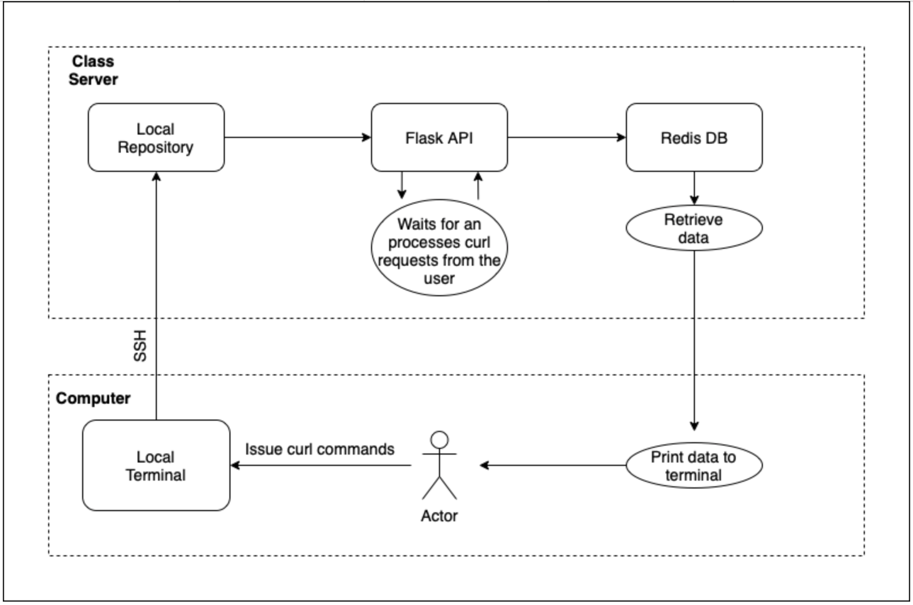

# Sleep-Stress Analysis Application

This application analyzes the relationship between various sleep parameters and stress level. These various sleep parameters include, snoring rate, respiration rate, body temperature, limb movement, and more. Specifically, this application allows the user to query the value of various parameters in a row and/or column, calculate single variable statistics for parameters, and plot two parameters on a graph and calculate their correlation. A more in depth description of each sleep parameter is available in the [Description of Parameters](#description-of-parameters) section. 

The data analyzed in this application was collected from [this website](https://www.kaggle.com/datasets/laavanya/human-stress-detection-in-and-through-sleep).

### Citations

Rachakonda, A. K. Bapatla, S. P. Mohanty, and E. Kougianos, “SaYoPillow: Blockchain-Integrated Privacy-Assured IoMT Framework for Stress Management Considering Sleeping Habits”, IEEE Transactions on Consumer Electronics (TCE), Vol. 67, No. 1, Feb 2021, pp. 20-29.

Rachakonda, S. P. Mohanty, E. Kougianos, K. Karunakaran, and M. Ganapathiraju, “Smart-Pillow: An IoT based Device for Stress Detection Considering Sleeping Habits”, in Proceedings of the 4th IEEE International Symposium on Smart Electronic Systems (iSES), 2018, pp. 161--166.

## Table of Contents

[Description of Parameters](#description-of-parameters) <br >
[Description of Scripts](#description-of-scripts) <br >
[Diagram of Process](#diagram-of-process) <br >
[How to Build Your Own Image](#how-to-build-your-own-image) <br >
[Deploy the Application to Kubernetes](#deploy-the-application-to-kubernetes) <br >
[How to Interact with the Application](#how-to-interact-with-the-application) <br >
[Interpret the Results](#interpret-the-results) <br >
[Test the Software System using Pytest](#test-the-software-system-using-pytest) <br >

## Description of Parameters

| Variable Name | Variable Description |
| ------------- | ------------- |
| Snoring Rate |  the average number of times a subject snored during a sleep session |
| Respiration Rate | the average number of breaths per minute for a subject during a sleep session |
| Body Temperature | the average temperature in Fahrenheit measured throughout the body  |
| Limb Movement | the average number of times a subject moved during a sleep session  |
| Blood Oxygen Level | the average amount of oxygen circulating throughout the body measured as a percentage |
| Eye Movement | the average number of eye movements for a subject during REM |
| Sleeping Hours  | the number of hours the subject slept during the session |
| Heart Rate  | the average heart rate of the subject measured in beats per minute (BPM) |
| Stress Level | measured on a scale from 1-5 (0 - low/normal, 1 – medium low, 2 - medium, 3 - medium high, 4 - high) |

## Description of Scripts
- `flask_api.py`: contains the various routes for the user to query
- `jobs.py`: creates jobs and posts them to the queue
- `worker.py`: retrieves jobs from the queue and processes them accordingly

## Diagram of Process



The diagram above illustrates the cycle of the ISS Positional and Sightings Data Application. First, the user issues curl commands on their local terminal. Those commands are then sent to the class server via ssh where they are received by the Flask server. Once the server has the request, the data requested will be retrieved from the Redis database which will then be displayed on the terminal for the user to see.

## Deploy the Application to Kubernetes

For better scalability and useability for our users, this application was deployed to the cloud using Kubernetes. Instructions on how to deploy this application to Kubernetes is available below.

First, `ssh` into isp02 using `ssh <username>@isp02.tacc.utexas.edu` then `ssh` into the Kubernetes Cluter using `ssh coe332-k8s.tacc.cloud`. Once in the Kubernetes Cluter, navigate to the `/kubernetes/prod` folder in the respository to access the YML files. Once in this directory, execute the `kubectl` commands below.

### Deploy Redis Server to Kubernetes
1. Deploy the Redis Deployment
    - `kubectl apply -f app-prod-db-deployment.yml`
2. Deploy the Redis Persistant Volume Claim
    - `kubectl apply -f app-prod-db-pvc.yml`
3. Deploy the Redis Service
    - `kubectl apply -f app-prod-db-service.yml`

### Deploy Flask API to Kubernetes
1. Deploy the Flask Deployment
    - `kubectl apply -f app-prod-api-deployment.yml`
2. Deploy the Flask Service
    - `kubectl apply -f app-prod-api-service.yml`

### Deploy Worker App to Kubernetes
1. Deploy the Worker Deployment
    - `kubectl apply -f app-prod-wrk-deployment.yml`

To see a list of all of the deployments and the pods just created, type `kubectl get all` in the terminal. After executing this command, you should see something similar to the following output:

```
[ianwood@kube-2 ~]$ kubectl get all
NAME                                           READY   STATUS    RESTARTS   AGE
pod/app-prod-api-deployment-596b558c89-8qxd2   1/1     Running   0          16h
pod/app-prod-api-deployment-596b558c89-zbrtd   1/1     Running   0          16h
..

NAME                           TYPE        CLUSTER-IP       EXTERNAL-IP   PORT(S)    AGE
service/app-prod-api-service   ClusterIP   10.100.224.72    <none>        5000/TCP   28h
service/app-prod-db-service    ClusterIP   10.109.224.160   <none>        6379/TCP   28h

NAME                                      READY   UP-TO-DATE   AVAILABLE   AGE
deployment.apps/app-prod-api-deployment   2/2     2            2           28h
deployment.apps/app-prod-db-deployment    1/1     1            1           28h
...

NAME                                                 DESIRED   CURRENT   READY   AGE
replicaset.apps/app-prod-api-deployment-596b558c89   2         2         2       16h
replicaset.apps/app-prod-api-deployment-5cb848f558   0         0         0       28h
...
```

Make a note of the Flask API Cluster-IP address and port number as these will be necessary to interact with the application, which is described in the following section. From the example above, the Flask API Cluster-IP address would be `10.100.224.72` and the port number would be `5000`.

## How to Interact with the Application

Interacting with this application consists of three steps the user must take: 
1. Find the Flask API Cluster-IP address and port number
2. `exec` into a debug pod on Kubernetes, and finally 
3. Execute `curl` commands in Kubernetes

These three steps are detailed below.

### Find IP Address and Port Number

In order to interact with the Flask API, we first need the Flask API Cluster-IP address and port number. To get these values, the Flask API and Redis Database services must first be deployed to Kubernetes, which is described in the previous section. Once these services are deployed, we can retrieve the Flask API Cluster-IP address and port number using the `kubectl get services` command:

```
[ianwood@kube-2 ~]$ kubectl get services
NAME                   TYPE        CLUSTER-IP       EXTERNAL-IP   PORT(S)    AGE
app-prod-api-service   ClusterIP   10.100.224.72    <none>        5000/TCP   28h
app-prod-db-service    ClusterIP   10.109.224.160   <none>        6379/TCP   28h
```

From the sample output above, we can see that the Flask API Cluster-IP address is `10.100.224.72` and the port number is `5000`. With these values, we can assemble the `curl` commands to interact with the application. However, before we can execute those `curl` commands, we first need to `exec` into a debug pod on Kubernetes.

### Exec into Debug Pod

To `exec` into a debug pod, we must first create the debug deployment. To do so we need to first create a YML file for this deployment, then deploy it to Kubernetes. To create the YML file, simply copy and paste the following contents into a new file called `deployment-python-debug.yml`.

```
---
apiVersion: apps/v1
kind: Deployment
metadata:
  name: py-debug-deployment
  labels:
    app: py-app
spec:
  replicas: 1
  selector:
    matchLabels:
      app: py-app
  template:
    metadata:
      labels:
        app: py-app
    spec:
      containers:
        - name: py39
          image: python:3.9
          command: ['sleep', '999999999']
```

Next, in the same directory as `deployment-python-debug.yml`, execute the following command to deploy to Kubernetes: `kubectl apply -f deployment-python-debug.yml`. Once the previous commands are executed, type `kubectl get pods` to ensure that the debug pod has been created.

```
[ianwood@kube-2 coe-332]$ kubectl get pods
NAME                                       READY   STATUS    RESTARTS   AGE
app-prod-api-deployment-596b558c89-8qxd2   1/1     Running   0          17h
app-prod-api-deployment-596b558c89-zbrtd   1/1     Running   0          17h
...
```

We can see from the sample output above, the debug pod `py-debug-deployment-5dfcf7bdd9-ptdxz` has successfully been created. Now to `exec` into this pod, simply execute `kubectl exec -it <name of your pod> /bin/bash`. In the case of the example above, we would execute `kubectl exec -it py-debug-deployment-5dfcf7bdd9-ptdxz /bin/bash` and recieve the following output.

```
[ianwood@kube-2 coe-332]$ kubectl exec -it py-debug-deployment-5dfcf7bdd9-ptdxz /bin/bash
kubectl exec [POD] [COMMAND] is DEPRECATED and will be removed in a future version. Use kubectl exec [POD] -- [COMMAND] instead.
root@py-debug-deployment-5dfcf7bdd9-ptdxz:/# 
```

Now we are in a new terminal inside the pod. From here we can execute `curl` commands as described in the following section. 

NOTE: to get back to the regular terminal, simply type `exit` in the debug terminal window.

```
root@py-debug-deployment-5dfcf7bdd9-ptdxz:/# exit
exit
[ianwood@kube-2 coe-332]$ 
```

### Execute curl Commands

Now that we have the Flask API Cluster-IP address and port number and the debug pod, we are finally able to start issuing `curl` commands to the Flask API. A comprehensive list of acceptable `curl` commands are provided below along with a brief description of each route.

NOTE: for the section below, a Flask API Cluster-IP address of `10.100.224.72` is used and the port number of `5000` is used, but these values are subject to change from user to user.

#### View a list of all the queryable routes
  - `curl 10.100.224.72:5000/getInfo/routes`
  - Once you run the command above, you should see the following output:
    ```
    ~jobs -- creating a new job to do some analysis
    ~uploadData -- download data from the csv file
    ~getInfo -- return column names
    ...
    ~getLoc/<col>/<value> -- return the postions of specific value in the dataset
    ~calcVar/column -- calculate the variance of specific column data values
    ```
  - Output above details how to download the data and provides a list of queryable routes

## Interpret the Results

The following sections display an example command and the resulting output. Remember to first download the data before executing any of the commands below: `curl 10.100.224.72:5000/uploadData -X POST`

### List of routes for you to easily jump to:

[/getInfo](#getinfo) <br >
[/getInfo/column/\<col>](#getinfocolumncol) <br >
[/getInfo/\<row>/\<col>](#getinforowcol) <br >
[/getInfo/\<col>/highest](#getinfocolhighest) <br >
[/getInfo/\<col>/lowest](#getinfocollowest) <br >
[/calcAvg/\<col>](#calcavgcol) <br >
[/calcVar/\<col>](#calcvarcol) <br >

### /getInfo
**Example Command:** `curl 10.100.224.72:5000/getInfo` <br >

**Example Output:**
```
Columns in Dataset:
  ['t', 'rr', 'sr', 'sr.1', 'lm', 'sl', 'bo', 'hr', 'rem']
```

From the example output above, we can see a list of the various sleep parameters available in this dataset. 

Link for you to go back to the [list of routes](#list-of-routes-for-you-to-easily-jump-to) <br >

### /getInfo/column/\<col>
**Example Command:** `curl 10.100.224.72:5000/getInfo/column/t` <br >

**Example Output:**
```
t column in Dataset:
  {'0': 91.84, '1': 91.552, '2': 96.0, '3': 90.768, '4': 97.872, '5': 95.376, '6': 97.2, '7': 99.0, '8': 96.168, '9': 95.104,
...
```

Here, we can see an output in JSON format where the key is the row number and the value is the value associated with a column, in this case t, and a row. 

Link for you to go back to the [list of routes](#list-of-routes-for-you-to-easily-jump-to) <br >

### /getInfo/\<row>/\<col>
**Example Command:** `curl 10.100.224.72:5000/getInfo/3/t` <br >

**Example Output:**
```
The value in 3 row t column is 90.768
```

From the example output above, we can see the row and column clearly labeled as 3 and t, respectively, and the value of that row and column being 90.768. 

Link for you to go back to the [list of routes](#list-of-routes-for-you-to-easily-jump-to) <br >

### /getInfo/\<col>/highest
**Example Command:** `curl 10.98.133.11:5000/getInfo/t/highest` <br >

**Example Output:**
```
The highest data in t values is 99.0
```

From the example output above, we can see that the maximum value of column t was 99.0.

Link for you to go back to the [list of routes](#list-of-routes-for-you-to-easily-jump-to) <br >

### /getInfo/\<col>/lowest
**Example Command:** `curl 10.100.224.72:5000/getInfo/t/lowest` <br >

**Example Output:**
```
The lowest data in t values is 0
```

From the example output above, we can see that the minimum value of column t was zero.

Link for you to go back to the [list of routes](#list-of-routes-for-you-to-easily-jump-to) <br >

### /calcAvg/\<col>
**Example Command:** `curl 10.100.224.72:5000/calcAvg/t` <br >

**Example Output:**
```
The average of t is 92.80
```

From the example output above, we can see the column clearly labeled as column t and the average value of the column being 92.80. 

Link for you to go back to the [list of routes](#list-of-routes-for-you-to-easily-jump-to) <br >

### /calcVar/\<col>
**Example Command:** `curl 10.100.224.72:5000/calcVar/t` <br >

**Example Output:**
```
The variance of t is 12.45
```

From the example output above, we can see the column clearly labeled as column t and the variance value of the column being 12.45. 

Link for you to go back to the [list of routes](#list-of-routes-for-you-to-easily-jump-to) <br >
